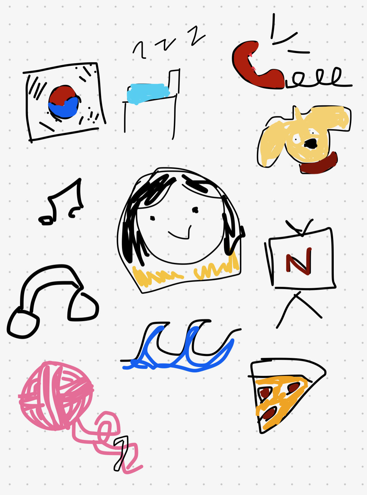

 
<h2 style ="color:MediumPurple;"> My homepage! </h2>

## About Me!

I'm a sophomore, born and raised here in San Diego. I have two brothers, and a dog named Gomi, she's six years old and grumpy. In my free time, I crochet and listen to music, mostly pop and blues. I love to sleep! zz. I've been learning how to insert images, I want to change the theme and hopefully the color of my backgrounds. I'm using the internet to add images and links. My favorite color is purple! but I guess blue is good too. 

 

My image! This is my freeform image, showing a couple of my interests. There's headphones, because I like to listen to music, and a yarn ball. I crochet a lot in my free time, it's one of my favorite hobbies. There's a Korean flag in the background, because I'm Korean. Other than that, I like to sleep or binge Netflix shows. 

<style>
    .text{border: 4px dotted DarkViolet;}
hr {border: 6px dotted Indigo}
hr {background-color: white}

